##  每个apple ID账号对应的tiktok哈希值不同，同一账号不同版本哈希值不同，不能通用


### 1. 注册 [Outlook 邮箱](https://signup.live.com/signup?sru=https%3a%2f%2flogin.live.com%2foauth20_authorize.srf%3flc%3d2052%26client_id%3d9199bf20-a13f-4107-85dc-02114787ef48%26cobrandid%3dab0455a0-8d03-46b9-b18b-df2f57b9e44c%26mkt%3dZH-CN%26opid%3d1D4EA5DC9930E905%26opidt%3d1759589404%26uaid%3d9c6e3a99c409c2bb702c56a53325a02b%26contextid%3dD52A59B7A9233641%26opignore%3d1&mkt=ZH-CN&uiflavor=web&fl=dob%2cflname%2cwld&cobrandid=ab0455a0-8d03-46b9-b18b-df2f57b9e44c&client_id=9199bf20-a13f-4107-85dc-02114787ef48&uaid=9c6e3a99c409c2bb702c56a53325a02b&suc=9199bf20-a13f-4107-85dc-02114787ef48&fluent=2&lic=1)

- [Outlook邮箱怎么注册？](https://zhuanlan.zhihu.com/p/1914368734669309671)


### 2. 注册美区 [Apple ID](https://account.apple.com/)

- [如何免费注册一个美区Apple ID?](https://blog.csdn.net/luo1374112132/article/details/138348700)
- [注册美国区Apple ID保姆级教程](https://kerrynotes.com/register-american-apple-id/)


### 3. App Store 登录美区ID

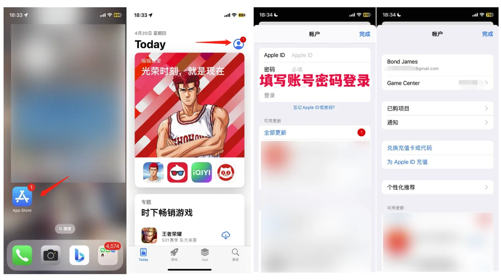


### 4. 支付宝购买美国区Apple礼品卡

- [用支付宝购买美国区Apple礼品卡](https://kerrynotes.com/alipay-buy-apple-gift-card/)
- [美区AppleID礼品卡购买充值保姆级教程](https://zhuanlan.zhihu.com/p/636121931)

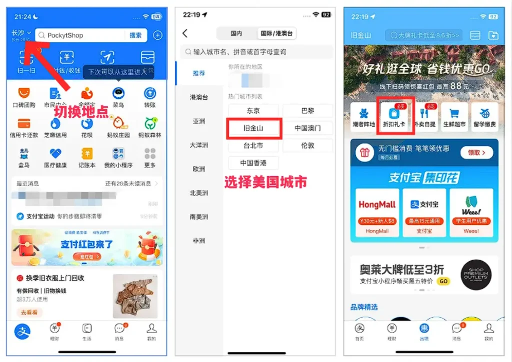

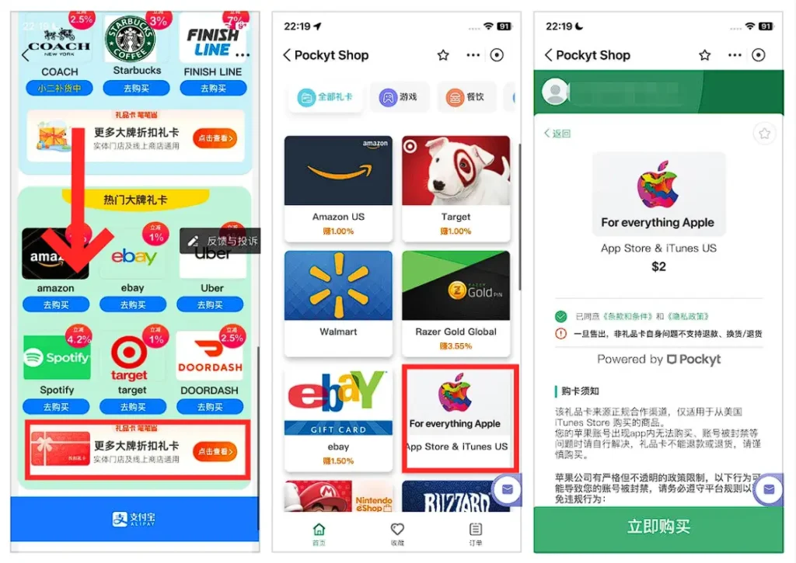

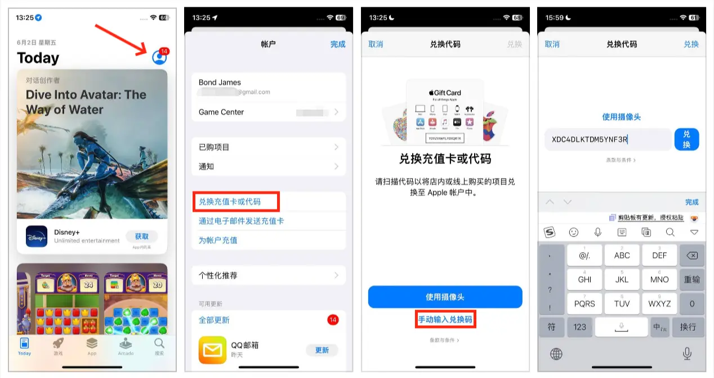


### 5. IOS安装代理工具

<table>
  <tr>
    <td style="text-align: center;">
      <a href="https://apps.apple.com/us/app/shadowrocket/id932747118">
        
        <br>
        <span>Shadowrocket</span>
      </a>
    </td>
    <td style="text-align: center;">
      <a href="https://apps.apple.com/us/app/quantumult-x/id1443988620">
        
        <br>
        <span>Quantumult X</span>
      </a>
    </td>
    <td style="text-align: center;">
      <a href="https://apps.apple.com/us/app/surge-5/id1442620678">
        
        <br>
        <span>Surge</span>
      </a>
    </td>
  </tr>
</table>


### 6. Windows 工具

<table>
  <tr>
    <td style="text-align: center;">
      <a href="https://secure-appldnld.apple.com/itunes12/091-87819-20180912-69177170-B085-11E8-B6AB-C1D03409AD2A6/iTunes64Setup.exe">
        
        <br>
        <span>iTunes v12.6.5.3</span>
      </a>
    </td>
    <td style="text-align: center;">
      <a href="https://www.52pojie.cn/thread-1931711-1-1.html">
        
        <br>
        <span>iOS App Store</span>
      </a>
    </td>
    <td style="text-align: center;">
      <a href="https://www.i4.cn/">
        
        <br>
        <span>爱思助手</span>
      </a>
    </td>
  </tr>
</table>


### 7. 安装 TikTok 21.1.0.ipa

- [为iPhone安装旧版本App](https://blog.csdn.net/m0_69137195/article/details/148291687)
- [iphone从App Store下载App历史版本](https://blog.csdn.net/qq_39925099/article/details/134841867)

1.打开爱思助手

2.选择应用安装

3.选择 TikTok 21.1.0.ipa

4.等待安装完成，安装完成以后**不可以**打开TikTok


### 8. 配置 Shadowrocket

1.打开Shadowrocket首页，点击+号

2.选择类型为Subscribe

3.把复制的节点，粘贴到URL

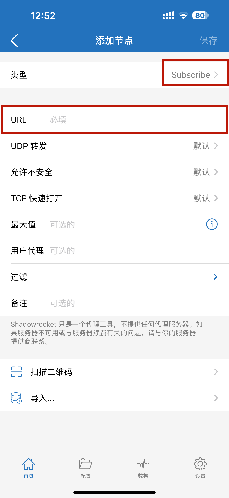

4.选择配置，点击+号导入URL配置，使用导入的配置

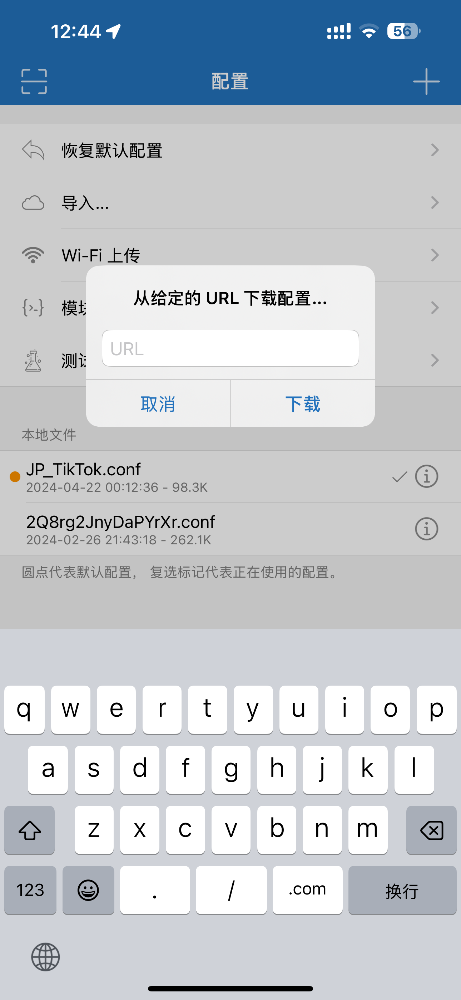

```
https://raw.githubusercontent.com/siemenstutorials/TikTok/master/JP_TikTok.conf
```
```
https://raw.githubusercontent.com/Semporia/TikTok-Unlock/master/Shadowrocket/TiKTok-JP.conf
```
```
https://raw.githubusercontent.com/Semporia/TikTok-Unlock/master/Shadowrocket/TiKTok-TW.conf
```
```
https://raw.githubusercontent.com/Semporia/TikTok-Unlock/master/Shadowrocket/TiKTok-KR.conf
```
```
https://raw.githubusercontent.com/Semporia/TikTok-Unlock/master/Shadowrocket/TiKTok-US.conf
```

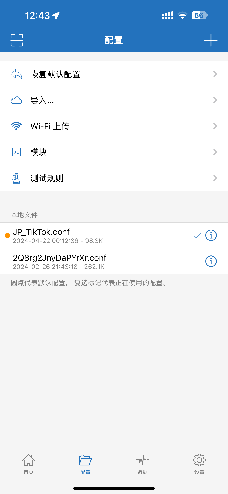

5.选择HTTPS解密

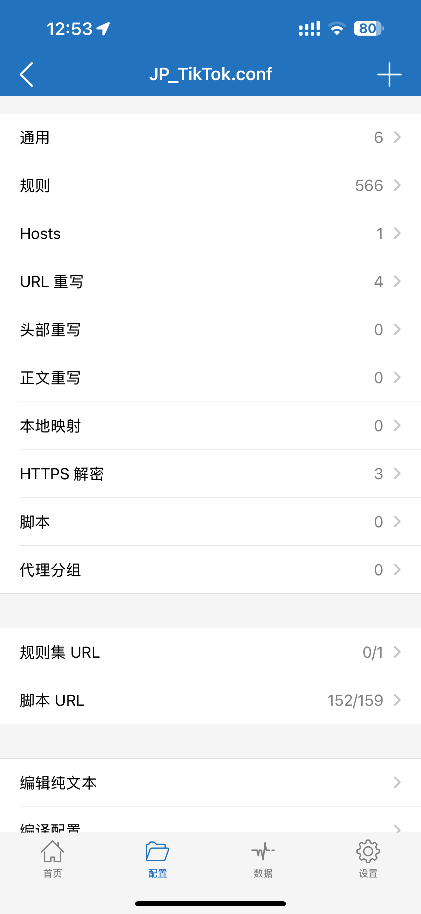

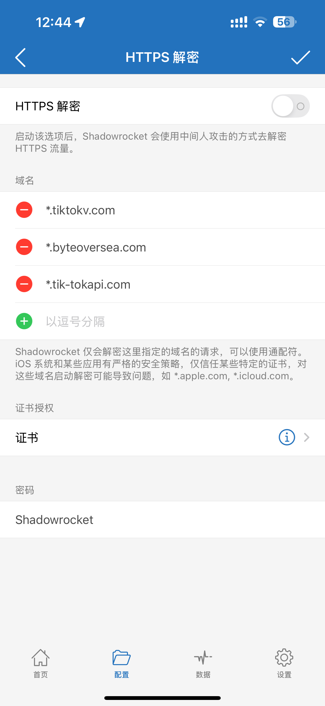

6.启动HTTPS解密，创建新证书，安装证书

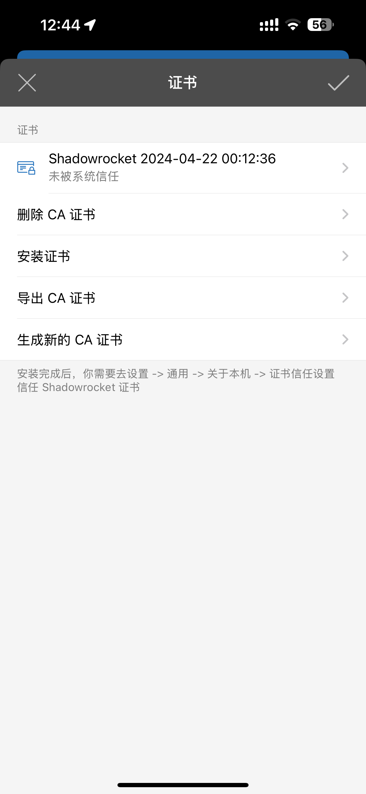

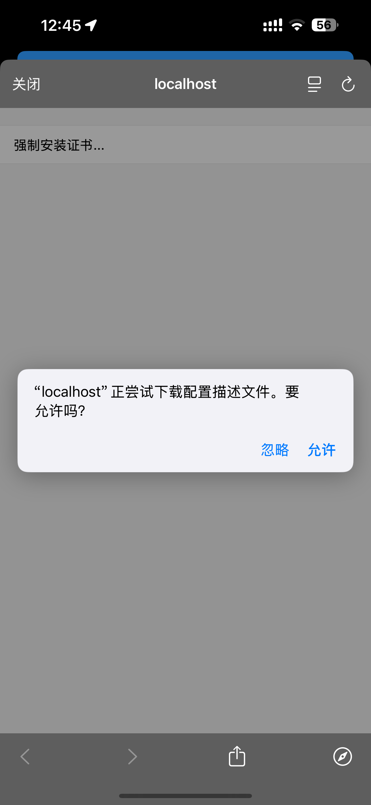

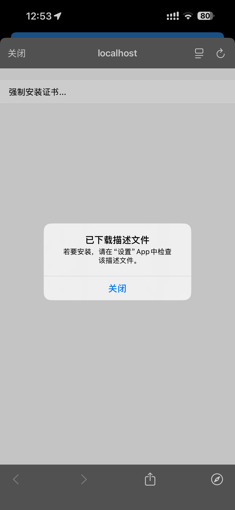

7.打开设置-通用-VPN与设备管理-找到Shadowrocket同意信任

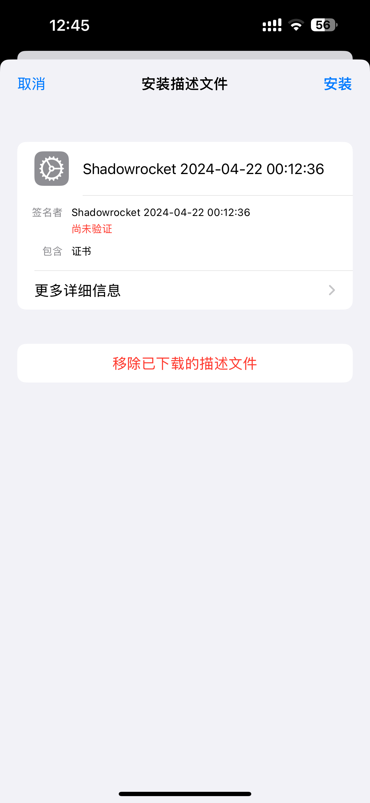

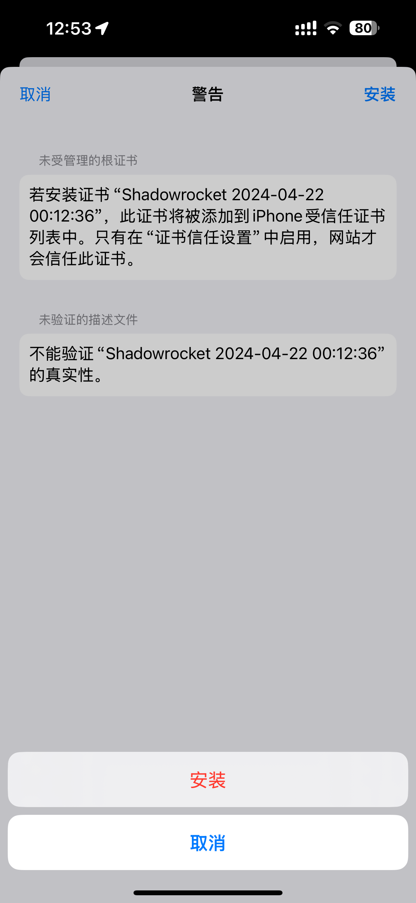

8.打开设置-通用-关于本机-证书信任设置-找到Shadowrocket同意信任

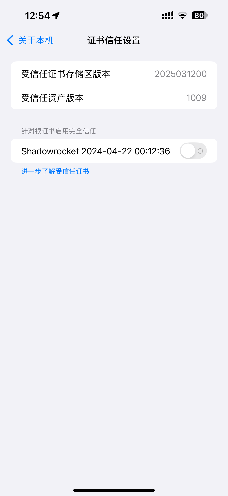

9.手机重启

10.启动**Shadowrocket**，启动**TikTok**


### 9. 配置 Surge

1.订阅URL下载配置

2.创建URL副本，并删除原配置URL

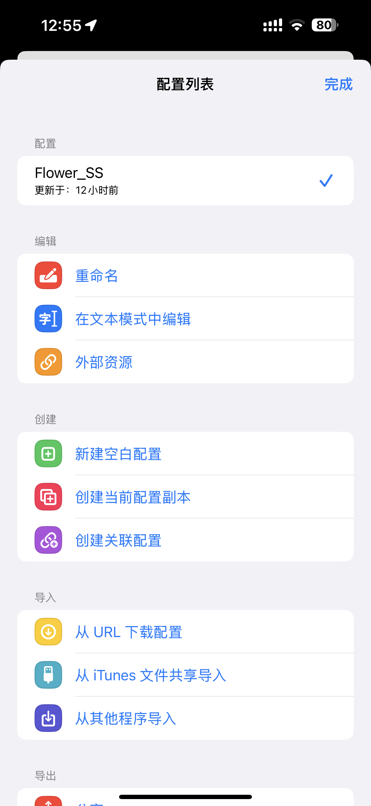

3.启动功能 复写 脚本 

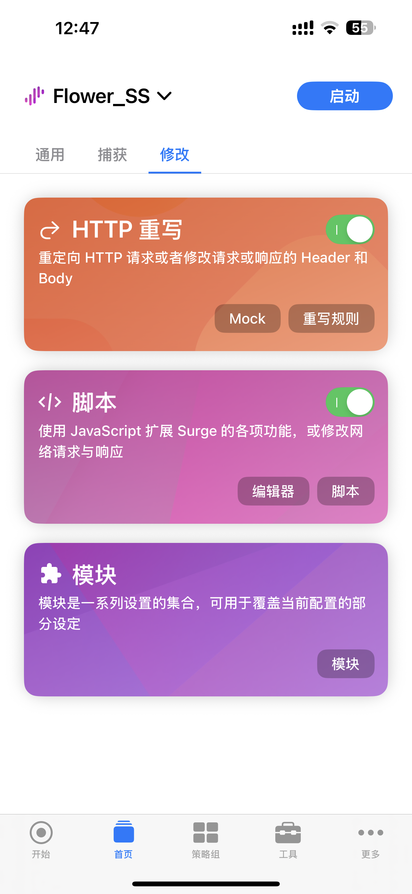

4.安装模块，并调整模块先后顺序

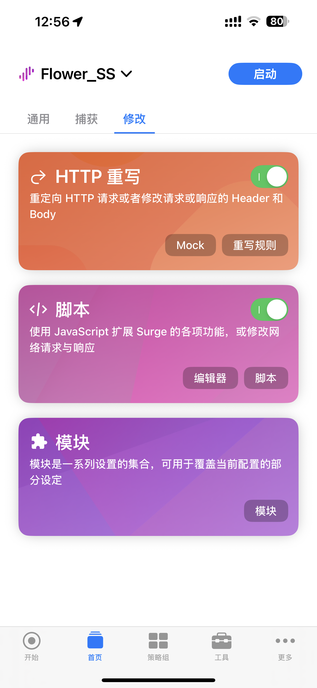

```
https://raw.githubusercontent.com/Semporia/TikTok-Unlock/master/Surge/TiKTok-JP.sgmodule
```
```
https://raw.githubusercontent.com/Semporia/TikTok-Unlock/master/Surge/TiKTok-TW.sgmodule
```
```
https://raw.githubusercontent.com/Semporia/TikTok-Unlock/master/Surge/TiKTok-KR.sgmodule
```
```
https://raw.githubusercontent.com/Semporia/TikTok-Unlock/master/Surge/TiKTok-US.sgmodule
```

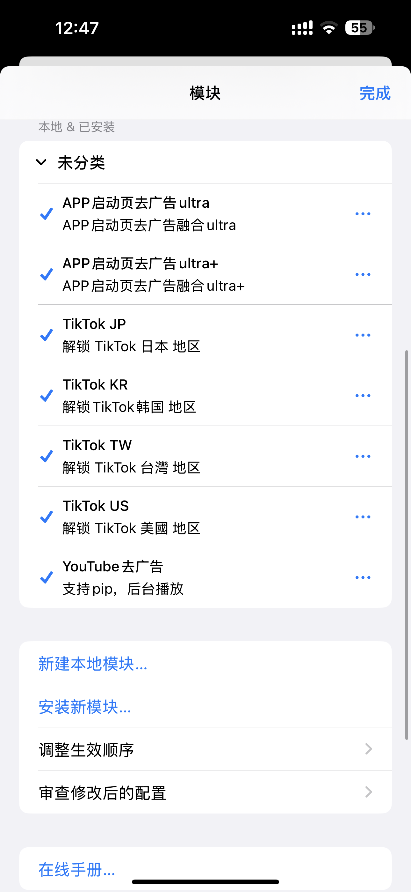

5.启动功能 MitM

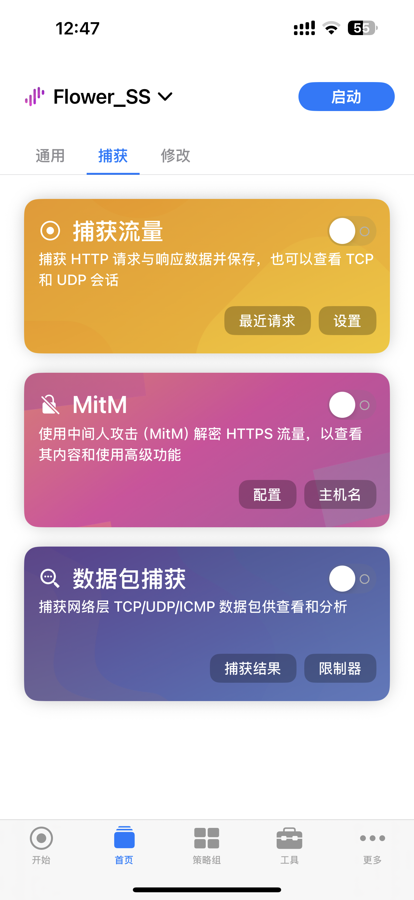

6.生成新证书，，安装证书

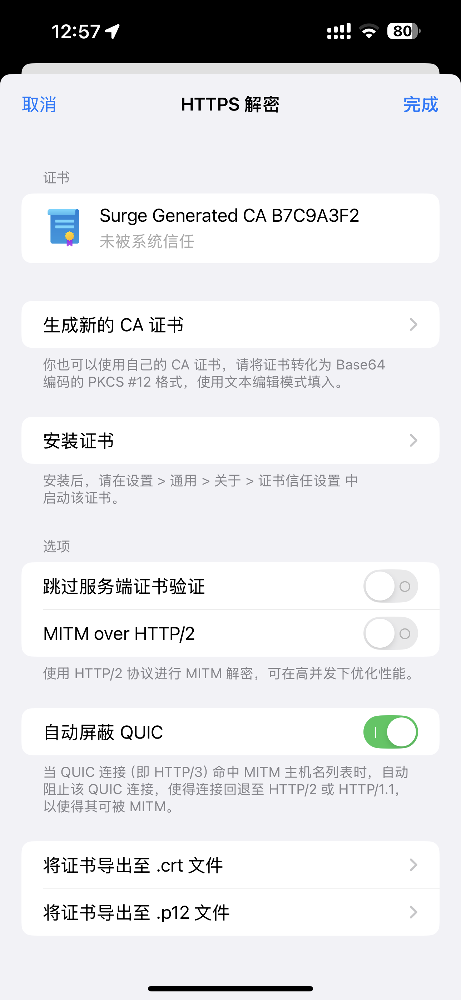

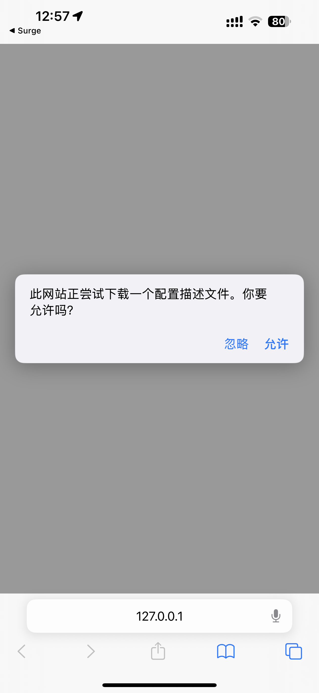

7.打开设置-通用-VPN与设备管理-找到Surge同意信任

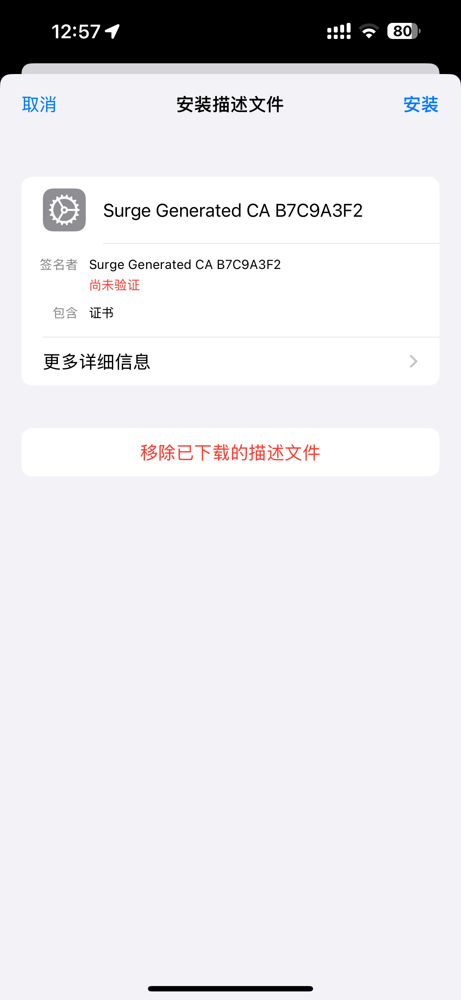

8.打开设置-通用-关于本机-证书信任设置-找到Surge同意信任

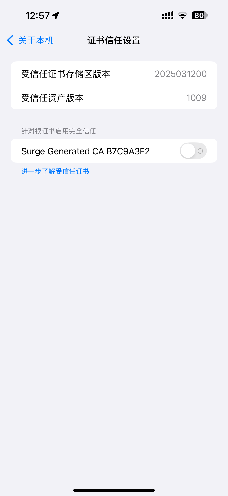

9.重启手机

10.启动**Surge**，启动**TikTok**
